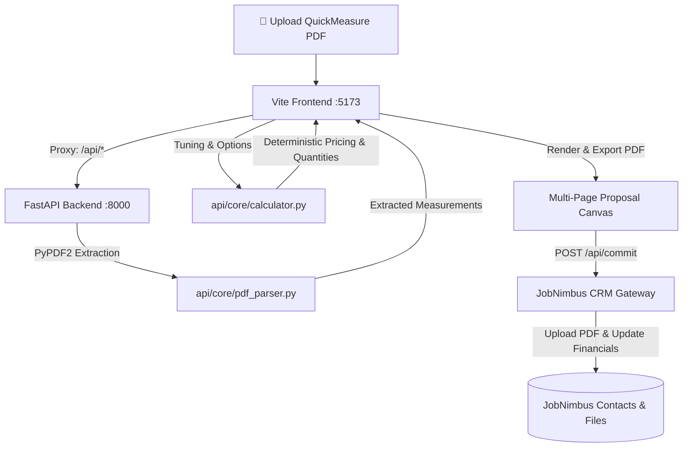

# 🏠 JobNimbus Roofing Proposal Automation

An end-to-end automated platform for roofing contractors to parse spatial roof measurements (QuickMeasure / GAF), compute real-time dynamic pricing with deterministic estimating math, generate professional multi-page proposals, and synchronize directly with the **JobNimbus CRM**.

---

## 📋 Table of Contents
- [System Architecture](#-system-architecture)
- [Key Features](#-key-features)
- [Tech Stack](#-tech-stack)
- [Project Directory Structure](#-project-directory-structure)
- [Prerequisites](#-prerequisites)
- [Environment Configuration](#-environment-configuration)
- [Getting Started & Local Development](#-getting-started--local-development)
  - [1. Backend Setup (FastAPI)](#1-backend-setup-fastapi)
  - [2. Frontend Setup (React + Vite)](#2-frontend-setup-react--vite)
- [API Endpoints Reference](#-api-endpoints-reference)
- [Vercel Deployment Guide](#-vercel-deployment-guide)
- [Troubleshooting & FAQs](#-troubleshooting--faqs)

---

## 🏗 System Architecture



---

## ✨ Key Features

1. **Automated PDF Measurement Extraction**:
   - Drag-and-drop QuickMeasure / GAF roof report PDFs.
   - Regex and spatial layout extraction for Roof Area (SQ/SF), Predominant Pitch, Eaves, Rakes, Ridges, Hips, Valleys, Step Flashing, and Headwalls.

2. **Deterministic Pricing Engine (`api/core/calculator.py`)**:
   - Replicates contractor spreadsheet calculations with waste factors, shingle tier matrices (CertainTeed, GAF, Owens Corning), tear-off labor tiers, deck replacement, pipe boots, and chimney reflashing.
   - Supports financing calculations, warranties, custom labor adjustments, and deposit rules.

3. **Interactive Proposal Builder & Document Canvas**:
   - Modern React control panel to toggle materials, warranties, and upgrades with real-time recalculation.
   - Print-ready A4/Letter proposal canvas featuring scope breakdown, itemized material specs, company branding, and customizable legal terms.

4. **Instant Client PDF Generation**:
   - Uses `html2pdf.js` for clean client-ready PDF downloads.

5. **Direct JobNimbus CRM Integration**:
   - Atomic commit endpoint (`/api/commit`):
     - Uploads the signed/generated PDF proposal directly to the contact's file attachments.
     - Updates financial custom fields (`cf_final_contract_price`, `cf_deposit_due`).
     - Moves contact status to `"Proposal Sent"` to automatically trigger email and SMS drip automations.

---

## 🛠 Tech Stack

### Frontend
- **Framework**: [React 18](https://react.dev/) + [Vite 5](https://vitejs.dev/)
- **HTTP Client**: [Axios](https://axios-http.com/) & Fetch API
- **PDF Export**: [html2pdf.js](https://github.com/eKoopmans/html2pdf.js)
- **Styling**: Modern Vanilla CSS Design System with responsive grid, glassmorphism, and print layout utilities

### Backend
- **Framework**: [FastAPI](https://fastapi.tiangolo.com/)
- **Server**: [Uvicorn](https://www.uvicorn.org/) (ASGI)
- **Data Validation**: [Pydantic v2](https://docs.pydantic.dev/)
- **PDF Parsing**: [PyPDF2](https://pypdf2.readthedocs.io/)
- **Async HTTP**: [HTTPX](https://www.python-httpx.org/) (for CRM API calls)

---

## 📂 Project Directory Structure

```text
roofing-proposal-automation/
├── api/                             # Python FastAPI Backend
│   ├── core/                        # Core Python business logic & math
│   │   ├── calculator.py            # Pricing engine & proposal formulas
│   │   ├── pdf_parser.py            # QuickMeasure PDF extractor
│   │   └── xml_parser.py            # GAF XML webhook parser
│   ├── index.py                     # FastAPI application entry point & routes
│   ├── requirements.txt             # Python dependencies
│   └── vercel.json                  # Vercel serverless function routing
├── src/                             # React Frontend Source
│   ├── assets/
│   │   └── main.css                 # Core CSS design system
│   ├── components/
│   │   ├── ControlPanel.jsx         # Sidebar controls for materials & pricing
│   │   ├── LandingPage.jsx          # PDF dropzone & job selection dashboard
│   │   └── ProposalTemplate/        # Printable proposal canvas components
│   │       ├── DocumentCanvas.jsx   # Multi-page layout orchestrator
│   │       ├── LegalTerms.jsx       # Contract legal terms & signature blocks
│   │       ├── PageWrapper.jsx      # Page layout wrapper
│   │       ├── ProposalHeader.jsx   # Company header & client meta info
│   │       ├── ProposalScope.jsx    # Itemized scope of work
│   │       ├── ProposalTable.jsx    # Pricing & financial summary table
│   │       └── ProposalTerms.jsx    # Warranty and payment schedule
│   ├── App.jsx                      # Main application component & state machine
│   └── main.jsx                     # Vite entry point
├── public/                          # Static assets (logos, icons)
├── index.html                       # HTML template
├── package.json                     # Node.js dependencies & scripts
├── vite.config.js                   # Vite config with /api proxy to FastAPI
└── vercel.json                      # Vercel SPA routing
```

---

## ⚙️ Prerequisites

Before running the project locally, ensure you have:
- **Node.js**: `v18.0.0` or higher ([Download Node.js](https://nodejs.org/))
- **Python**: `v3.10` or higher ([Download Python](https://www.python.org/))
- **pip**: Python package manager (included with Python)

---

## 🔑 Environment Configuration

Create a `.env` file in `roofing-proposal-automation/` (or set these in your deployment dashboard):

```ini
# JobNimbus CRM API Key (required for CRM sync)
JOBNIMBUS_API_KEY=your_jobnimbus_api_key_here

# Base URL for frontend API calls (Leave blank for local dev with Vite proxy)
VITE_API_BASE_URL=
```

---

## 🚀 Getting Started & Local Development

To run the application locally, you will run **two terminal windows**: one for the FastAPI backend and one for the React frontend.

### 1. Backend Setup (FastAPI)

1. Open your terminal and navigate to the `roofing-proposal-automation/api` directory:
   ```bash
   cd roofing-proposal-automation/api
   ```

2. Install the required Python dependencies:
   ```bash
   pip install -r requirements.txt
   ```

3. Start the FastAPI server on port **8000**:
   ```bash
   uvicorn index:app --reload --port 8000
   ```
   > 💡 *Note: The backend must be running on port `8000` because the Vite dev server proxies all `/api/*` calls to `http://127.0.0.1:8000`.*

---

### 2. Frontend Setup (React + Vite)

1. Open a **second terminal window** and navigate to `roofing-proposal-automation`:
   ```bash
   cd roofing-proposal-automation
   ```

2. Install Node packages:
   ```bash
   npm install
   ```

3. Start the Vite development server:
   ```bash
   npm run dev
   ```

4. Open your browser and navigate to:
   ```
   http://localhost:5173
   ```

---

## 📡 API Endpoints Reference

| Method | Endpoint | Description |
|---|---|---|
| `POST` | `/api/parse-pdf` | Accepts a multipart PDF upload and returns extracted measurements JSON. |
| `POST` | `/api/calculate` | Accepts `ProposalRequest` payload and returns calculated item quantities, totals, and pricing. |
| `POST` | `/api/commit` | Uploads generated PDF to JobNimbus, updates financials, and marks status as `"Proposal Sent"`. |
| `POST` | `/api/webhook/gaf` | Webhook receiver for raw XML measurement payloads from GAF. |
| `GET` | `/api/health` | Healthcheck verification endpoint. |

---

## 🌐 Vercel Deployment Guide

This project is configured to deploy directly to Vercel as a full-stack application (Vite SPA + Serverless Python API):

1. Install the Vercel CLI or connect your GitHub repository to [Vercel](https://vercel.com).
2. Set the **Root Directory** to `roofing-proposal-automation`.
3. In the Vercel Project Settings:
   - **Framework Preset**: `Vite`
   - **Build Command**: `npm run build`
   - **Output Directory**: `dist`
4. Add your **Environment Variables** in Vercel:
   - `JOBNIMBUS_API_KEY`: Your JobNimbus API key.
5. Deploy! Vercel will automatically host the React frontend and execute `api/index.py` as a serverless function for all `/api/*` routes.

---

## ❓ Troubleshooting & FAQs

#### 1. `Error: connect ECONNREFUSED 127.0.0.1:8000`
- **Cause**: The Vite frontend attempted to make an API request (e.g., `/api/parse-pdf`), but the Python backend is not running on port 8000.
- **Fix**: Open a separate terminal, navigate to `roofing-proposal-automation/api`, and run `uvicorn index:app --reload --port 8000`.

#### 2. `ERROR: Could not open requirements file: No such file or directory`
- **Cause**: Running `pip install -r api/requirements.txt` while already inside the `api/` directory.
- **Fix**: If you are inside `api/`, run `pip install -r requirements.txt`. If in the project root, run `pip install -r api/requirements.txt`.

#### 3. `uvicorn: command not found`
- **Fix**: Run via python module execution:
  ```bash
  python -m uvicorn index:app --reload --port 8000
  ```
